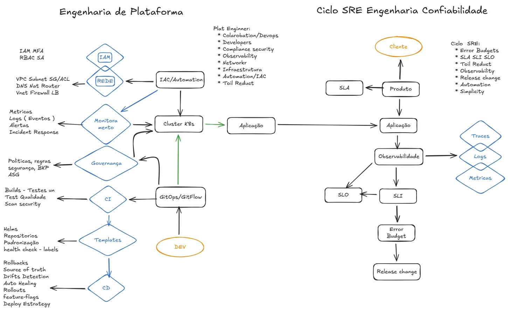

# 📚 Guia da Observabilidade

> Um roteiro de estudos sobre Observabilidade e SRE.  
> Cada tópico segue a estrutura: **Resumo → Exemplo → Pergunta para reflexão**.



---

## 🗺️ Roteiro de Estudos

O caminho sugerido de leitura (de cima para baixo):

```
                    ┌──────────────────────┐
                    │   Observabilidade    │
                    │   vs Monitoramento   │
                    └────────┬─────────────┘
                             │
              ┌──────────────┼──────────────┐
              │              │              │
        ┌─────┴─────┐ ┌─────┴─────┐ ┌──────┴─────┐
        │   Logs    │ │  Métricas │ │   Traces   │
        └─────┬─────┘ └─────┬─────┘ └──────┬─────┘
              │              │              │
              └──────────────┼──────────────┘
                             │
              ┌──────────────┼──────────────┐
              │              │              │
        ┌─────┴──────┐ ┌────┴─────┐ ┌──────┴──────┐
        │ OpenTelem. │ │ Alertas  │ │ Dashboards  │
        └─────┬──────┘ └────┬─────┘ └──────┬──────┘
              │              │              │
              └──────────────┼──────────────┘
                             │
              ┌──────────────┼──────────────┐
              │              │              │
        ┌─────┴─────┐ ┌─────┴─────┐ ┌──────┴──────┐
        │  Golden   │ │ Maturid.  │ │ SLI → SLO   │
        │  Signals  │ │  (OMM)    │ │   → SLA     │
        └───────────┘ └───────────┘ └──────┬──────┘
                                           │
              ┌──────────────┬─────────────┤
              │              │             │
        ┌─────┴─────┐ ┌─────┴─────┐ ┌─────┴──────┐
        │  Error    │ │   MTTR    │ │ Incident   │
        │  Budget   │ │           │ │ Management │
        └───────────┘ └───────────┘ └──────┬─────┘
                                           │
              ┌──────────────┬─────────────┤
              │              │             │
        ┌─────┴──────┐ ┌─────┴─────┐ ┌─────┴──────┐
        │Post-Mortem │ │Release &  │ │    TOI     │
        │            │ │  Change   │ │            │
        └─────┬──────┘ └─────┬─────┘ └─────┬──────┘
              │              │             │
              └──────────────┼─────────────┘
                             │
              ┌──────────────┼──────────────┐
              │              │              │
        ┌─────┴──────┐ ┌─────┴─────┐ ┌─────┴──────┐
        │  On-Call   │ │  Runbooks │ │Troubleshoot│
        └────────────┘ └───────────┘ └──────┬─────┘
                                            │
                             ┌──────────────┼──────────────┐
                             │              │              │
                       ┌─────┴──────┐ ┌─────┴─────┐ ┌─────┴──────┐
                       │  Lab 01   │ │  Lab 02   │ │  Lab 03   │
                       │ Métricas  │ │   Logs    │ │  Traces   │
                       └─────┬─────┘ └─────┬─────┘ └─────┬──────┘
                             │              │              │
                             └──────────────┼──────────────┘
                                            │
                                   ┌────────┴────────┐
                                   │     Lab 04     │
                                   │ Stack Completa │
                                   └────────┬────────┘
                                            │
                                   ┌────────┴────────┐
                                   │  Certificações  │
                                   │   🎓 Blueprints │
                                   └─────────────────┘
```

---

## 📖 Conteúdo

### Parte 1 — Observabilidade (Fundamentos e Pilares)

| # | Tópico | Descrição |
|---|--------|-----------|
| 1 | [🔍 Observabilidade vs Monitoramento](Observabilidade/ObservabilidadeVsMonitoramento.md) | A diferença fundamental — por onde tudo começa |
| 2 | [📄 Logs](Observabilidade/Logs.md) | Registros de eventos — o pilar mais fundamental |
| 3 | [📊 Métricas](Observabilidade/Metricas.md) | Valores numéricos ao longo do tempo — tendências e alertas |
| 4 | [🔗 Traces](Observabilidade/Traces.md) | Rastreamento distribuído — o caminho da requisição |
| 5 | [🔭 OpenTelemetry](Observabilidade/OpenTelemetry.md) | O padrão aberto para instrumentação |
| 6 | [🚨 Alertas](Observabilidade/Alertas.md) | Quando e como notificar que algo precisa de ação |
| 7 | [📊 Dashboards](Observabilidade/Dashboards.md) | Design de painéis — como visualizar o que importa |
| 8 | [🏔️ Maturidade (OMM)](Observabilidade/Omm.md) | Avaliando onde você está na jornada |

### Parte 2 — SRE (Site Reliability Engineering)

| # | Tópico | Descrição |
|---|--------|-----------|
| 9 | [🌟 Golden Signals](SRE/GoldenSignals.md) | As 4 métricas fundamentais do Google |
| 10 | [📏 SLI](SRE/SLI.md) | Service Level Indicator — o que você mede |
| 11 | [🎯 SLO](SRE/SLO.md) | Service Level Objective — a meta que você define |
| 12 | [📝 SLA](SRE/SLA.md) | Service Level Agreement — o contrato com o cliente |
| 13 | [💰 Error Budget](SRE/ErrorBudget.md) | O orçamento de falhas que equilibra velocidade e estabilidade |
| 14 | [⏱️ MTTR](SRE/MTTR.md) | Mean Time to Recovery — velocidade de recuperação |
| 15 | [🔎 Post-Mortem](SRE/PostMortem.md) | Análise blameless de incidentes — aprender sem culpar |
| 16 | [🚀 Release & Change](SRE/ReleaseChange.md) | Deploys seguros — canary, blue/green, feature flags, DORA |
| 17 | [📤 TOI](SRE/TOI.md) | Transfer of Information — transferência de conhecimento operacional |

### Parte 3 — Na Prática

| # | Tópico | Descrição |
|---|--------|----------|
| 18 | [🚒 Incident Management](SRE/IncidentManagement.md) | Coordenação de incidentes — papéis, comunicação, processo |
| 19 | [📟 On-Call](SRE/OnCall.md) | Plantão — escalas, expectativas e saúde do time |
| 20 | [📋 Runbooks](SRE/Runbooks.md) | Manuais de emergência — como escrever e manter |
| 21 | [🔧 Troubleshooting](troubleshooting.md) | Guia prático de investigação de incidentes |

### Parte 4 — Labs Práticos (Docker Compose)

| # | Lab | Descrição |
|---|-----|-----------|
| 22 | [🧪 Visão Geral dos Labs](Labs/index.md) | Pré-requisitos, arquitetura e progressão |
| 23 | [📊 Lab 01 — Métricas](Labs/lab01-metricas-prometheus-grafana.md) | Prometheus + Grafana — instrumentação e PromQL |
| 24 | [📋 Lab 02 — Logs](Labs/lab02-logs-loki.md) | Loki + Promtail — logs estruturados e LogQL |
| 25 | [🔗 Lab 03 — Traces](Labs/lab03-traces-tempo.md) | Tempo + OTel — distributed tracing em microserviços |
| 26 | [🔭 Lab 04 — Stack Completa](Labs/lab04-otel-stack-completa.md) | OTel Collector + Prometheus + Loki + Tempo + Grafana |
| 27 | [🚀 Lab 05 — LGTM All-in-One](Labs/lab05-lgtm.md) | grafana/otel-lgtm — stack completa em 1 container, ~5 min |

### Parte 5 — Certificações (Blueprints de Estudo)

| # | Certificação | Organização | Custo |
|---|-------------|-------------|-------|
| 28 | [🔭 Observability Foundation](Certificacoes/ObservabilityFoundation.md) | DevOps Institute | ~$350 |
| 29 | [🛡️ SRE Foundation](Certificacoes/SREFoundation.md) | DevOps Institute | ~$350 |
| 30 | [🛡️ SRE Practitioner](Certificacoes/SREPractitioner.md) | DevOps Institute | ~$350 |
| 31 | [📊 PCA — Prometheus](Certificacoes/PCA.md) | CNCF | $250 |
| 32 | [🔭 OTCA — OpenTelemetry](Certificacoes/OTCA.md) | CNCF | $250 |

---

## 🎓 Como usar este guia

Cada página segue um padrão de estudo:

1. **📖 Leia o resumo** — entenda o conceito em poucas linhas
2. **💻 Analise o exemplo** — veja como funciona na prática
3. **🤔 Responda a pergunta** — tente responder antes de seguir em frente
4. **🔄 Revise** — volte após alguns dias e veja se ainda lembra

> Esta abordagem combina **Elaborative Interrogation** (perguntas que forçam o pensamento profundo) com **Active Recall** (tentar lembrar antes de reler). São técnicas comprovadas pela ciência da aprendizagem.

---

## 📚 Referências recomendadas

| Recurso | Tipo |
|---------|------|
| [Google SRE Book](https://sre.google/sre-book/table-of-contents/) | Livro (gratuito) |
| [Google SRE Workbook](https://sre.google/workbook/table-of-contents/) | Livro (gratuito) |
| [OpenTelemetry Docs](https://opentelemetry.io/docs/) | Documentação |
| [Prometheus Docs](https://prometheus.io/docs/) | Documentação |
| [Grafana Learning](https://grafana.com/tutorials/) | Tutoriais |
